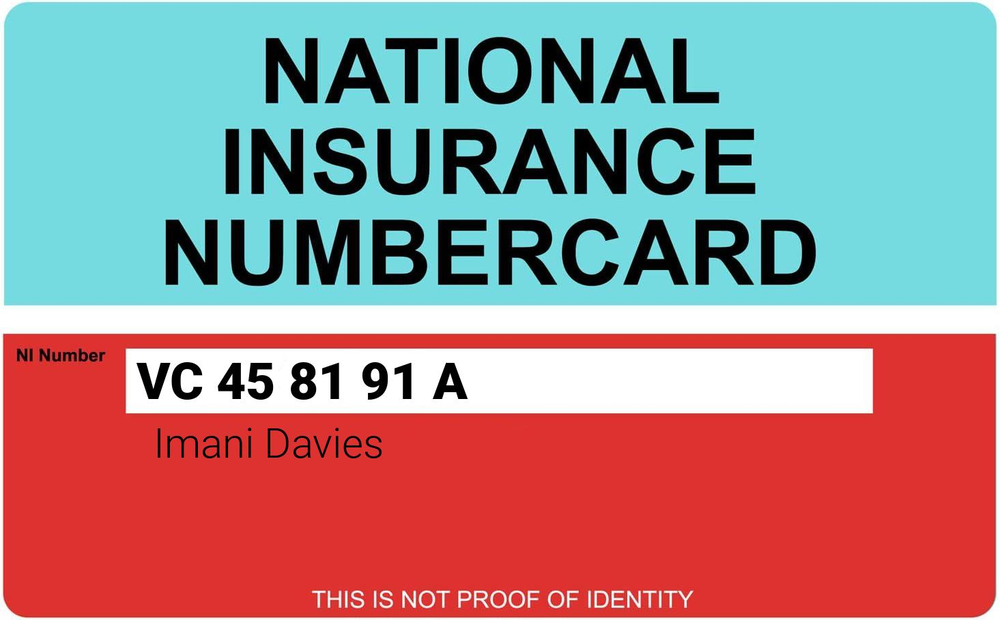

# JohnDoe Documentation

The `JohnDoe` class generates synthetic personal information (PII) for testing environments. It creates mock details of a person, including name, age, address, phone number, email, and more.

## Class Overview

This class allows you to generate random personal information and related documents.


### Setup
1. Clone the repo into the desired location
```bash
$ git clone https://github.com/IanUmney/JohnDoe.git
```
2. Change into that directory
```bash
$ cd JohnDoe/
```
3. Install via pip
```bash
$ pip install -r requirements.txt
```

### Usage
Import into python project
```python
from johndoe import JohnDoe

# Create a JohnDoe instance
jd = JohnDoe()

# print JSON to terminal
print(jd.json())
```
or from the command line
```bash
$ python3 -m johndoe --document
```

### Example output:
```json
{
    "gender": "f",
    "name": "Mina Nightingale",
    "age": 44,
    "documents": false,
    "nino": "JE 95 43 28 O",
    "email": "Mina.Nightingale@icloud.com",
    "address": {
        "house_number": 8,
        "street": "Mill Road",
        "area": "Cornwall",
        "postcode": "PL31 1AN"
    },
    "birthday": "11/02/1979",
    "banking": {
        "bank": "LLOYDS BANK PLC",
        "sort_code": "60-19-08",
        "account_number": 79538994,
        "card_number": "5573 5725 3020 6413",
        "provider": "Mastercard",
        "expiry_date": "1/31",
        "cvv": "425"
    },
    "ip_address": "89.193.96.236",
    "mobile_number": {
        "number": "07826959922",
        "provider": "Vodafone"
    },
    "driving_license": "NIGHT7711999JE 50"
}
```
#### National Identity Card

#### National Insurance Number Card



## Upcoming Features
- Document creation
  - Generate bank card and national identity card images
- AI image creation (re-integration)
- More PII
  - Work history
  - Online accounts / passwords
  - Education
  - and more